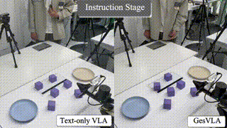
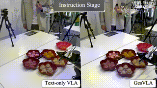
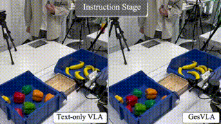

# GesVLA: Gesture-Aware Vision-Language-Action Model with Embedded Representations

<p align="center" style="margin:1.4em 0 0.8em;">
  <a href="https://GWxuan.github.io/GesVLA/"></a>
  &nbsp;
  <a href="https://arxiv.org/abs/2605.22812"></a>
  &nbsp;
  <a href="https://cloud.tsinghua.edu.cn/d/41fa523bc7ae4565ac03/"></a>
</p>

<!-- [Wenxuan Guo](https://GWxuan.github.io/)<sup>1\*</sup>,
Ziyuan Li<sup>1\*</sup>,
Meng Zhang<sup>2†</sup>,
Yichen Liu<sup>1</sup>,
Yimeng Dong<sup>1</sup>,
Chuxi Xu<sup>1</sup>,
Yunfei Wei<sup>2</sup>,
Ze Chen<sup>2</sup>,
Erjin Zhou<sup>2</sup>,
[Jianjiang Feng](https://ivg.au.tsinghua.edu.cn/~jfeng/index.html)<sup>1‡</sup>

<sup>1</sup>Tsinghua University,
<sup>2</sup>Dexmal

<sup>\*</sup> Equal contributions. <sup>†</sup> Project leader. <sup>‡</sup> Corresponding author. -->

## 🛠️ Installation

We manage Python dependencies with [uv](https://docs.astral.sh/uv/). If you haven't installed `uv`, please follow [uv installation instructions](https://docs.astral.sh/uv/getting-started/installation/) to set it up.

Run the following to set up the environment:

```bash
GIT_LFS_SKIP_SMUDGE=1 uv sync
GIT_LFS_SKIP_SMUDGE=1 uv pip install -e .
```

> NOTE: `GIT_LFS_SKIP_SMUDGE=1` is needed to pull LeRobot as a dependency.

For more details, refer to the original [openpi repository](https://github.com/Physical-Intelligence/openpi.git).

## 🚀 Training GesVLA

### Data Preparation

All data should be placed under the `data/` directory at the project root. The directory structure should look like the following:

```
data/
├── datasets/
│   ├── gestureVLA_2026xxxx/           # Robot arm action dataset
│   └── pointing_dataset_xxxx/         # Synthetic gesture reasoning data
├── reasoning/
│   └── reference_images/              # Visual prompt reference images
├── gesture_data/
│   └── realgesdata/                   # Real gesture reasoning data (aligned with robot actions)
...
```

All datasets can be obtained from [here](https://cloud.tsinghua.edu.cn/d/41fa523bc7ae4565ac03/). We provide synthetic data for the block scene, which can be used to train and validate the Intent Reasoning model of GesVLA. Additional synthetic data can be generated using the data generation pipeline in `data_generation/`. We also provide robot arm action data for the block, jelly, and fruit/vegetable scenes. The amount of provided data exceeds the training requirement, so you can select as needed.

### Training Pipeline

This project adopts a two-stage training paradigm. First, the Intent Reasoning model is pre-trained on synthetic gesture reasoning data. Before training, ensure that `data/datasets/pointing_dataset_xxxx` exists. Run:

```bash
bash train_scripts/train_ges_reasoning.sh
```

After training, the model checkpoint will be automatically saved to the `models/` directory. Then, proceed to train the GesVLA model. Before training, make sure the Intent Reasoning checkpoint path is correctly configured. GesVLA loads and freezes the Intent Reasoning checkpoint for intent reasoning, while fine-tuning the remaining parts of the model. Training requires real robot action data `data/datasets/gestureVLA_2026xxxx`, real gesture pointing data `data/gesture_data/realgesdata/` (aligned with real robot actions at the episode level), and visual prompt images `data/reasoning/reference_images/` (obtained by batch inference of real gesture data using the pre-trained Intent Reasoning model, to accelerate training). Run:

```bash
bash train_scripts/train_gesvla_2vlm.sh
```

Configuration for both training stages can be adjusted in the training scripts.

## 🦾 Deployment

We adopt a policy server + hardware client architecture for deployment. We provide the server-side deployment code. The client-side code should provide observation data to the server and receive action data for execution. You can implement the client based on your own robot hardware configuration.

Configure the model checkpoint path and run:

```bash
bash scripts/serve_2vlm.sh
```

## 🎬 Demo

Real-world rollouts with a 7-DoF manipulator and three-camera observations (global, side, gripper). Each clip follows combined gesture-and-language instructions. For clearer videos, see the [project page](https://GWxuan.github.io/GesVLA/).

### Pick-and-Place Block

Grasp a specified block from clutter and place it on the designated plate.

<p align="center">
  
</p>

### Select Jelly

Pick specified jelly cups in pointing order and place them into a target plate.

<p align="center">
  
</p>

### Select Fruit and Vegetable

Pick specified bell peppers and bananas in pointing order and place them into a basket.

<p align="center">
  
</p>

## 🙏 Acknowledgements

We express our sincere gratitude to the developers of [openpi](https://github.com/Physical-Intelligence/openpi.git) and [OneTwoVLA](https://github.com/Fanqi-Lin/OneTwoVLA.git) for open-sourcing their code, which has provided strong support for our project.


## 📜 Citation

```bibtex
@article{guo2026gesvla,
      title={GesVLA: Gesture-Aware Vision-Language-Action Model Embedded Representations}, 
      author={Wenxuan Guo and Ziyuan Li and Meng Zhang and Yichen Liu and Yimeng Dong and Chuxi Xu and Yunfei Wei and Ze Chen and Erjin Zhou and Jianjiang Feng},
      journal={arXiv preprint arXiv:2605.22812},
      year={2026},
      url={https://arxiv.org/abs/2605.22812}, 
}
```
